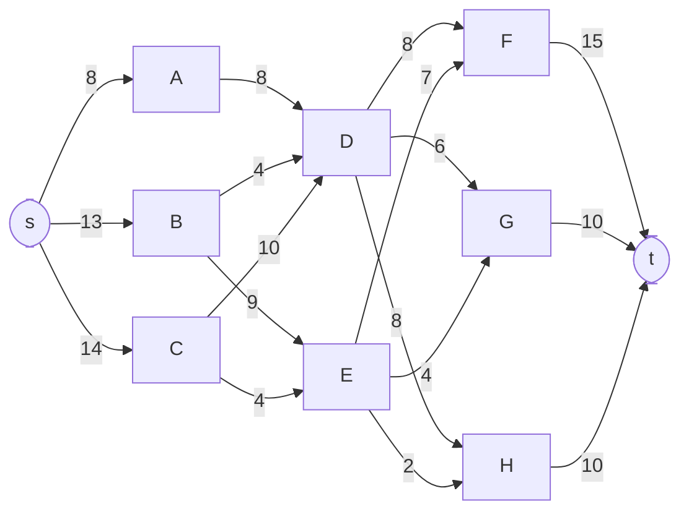
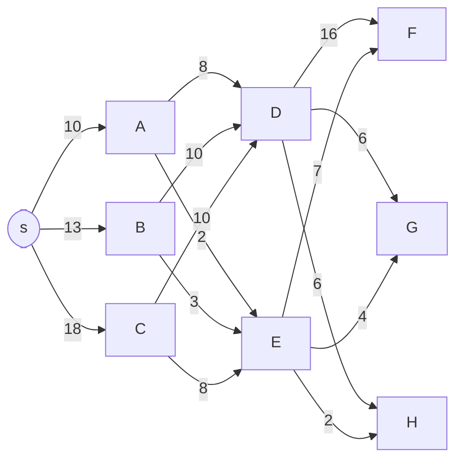
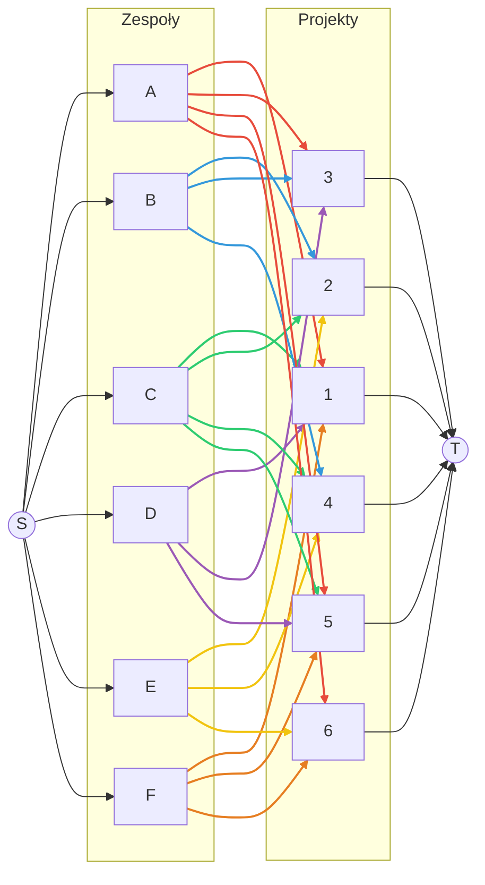
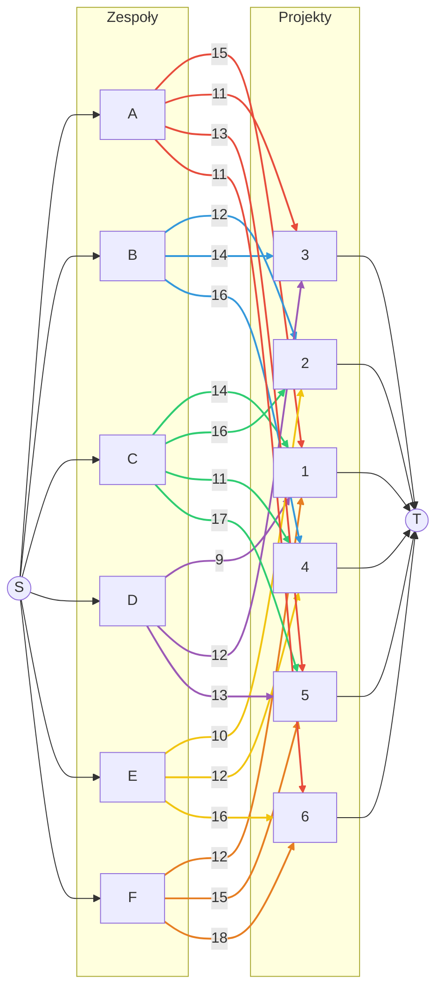

# Zadanie 1

## Sieć przepływowa
Diagram przepływu:
![[diag-flow.jpg]]
Zgodnie z tabelką pierwszą wartością jest koszt, drugą zaś przepustowość
**Problem do rozwiązania:** Jest to jednotowarowa sieć przepływowa na której należy rozwiązać problem najtańszego przepływu
### Implementacja modelu programowania liniowego

Zapotrzebowanie dobowe elektrowni wynosi:
$$
F_{\text{zadane}} = Z_{F} + Z_{G} + Z_{H} = 35
$$
Możliwości wydobywcze kopalń wynoszą:
$$
Z_{A} = 10 \\
Z_{B} = 13 \\
Z_{C} = 22
$$

#### Zbiory
Wszystkie wierzchołki sieci przepływowej:
$$
V = \{s, A, B, C, D, E, F, G, H, t\} \\
$$
Wierzchołki poza źródłami i ujściami:
$$
V' = V \setminus \{s, t\}
$$
Połączenia między wierzchołkami:
$$
E \subseteq V \times V
$$
#### Parametry
Koszty transportu na poszczególnych odcinkach:
$$
c_{ij} \quad \forall (i,j) \in E
$$
Przepustowości na poszczególnych odcinkach:
$$
u_{ij} \quad \forall (i,j) \in E
$$
F_zadane - zapotrzebowanie dobowe elektrowni:
$$
F_{\text{zadane}} = 35
$$

#### Zmienne decyzyjne
Ilość węgla transportowanego z wierzchołka i do wierzchołka j:
$$
x_{ij} \quad \forall (i,j) \in E
$$
#### Funkcja celu
Minimalizacja kosztów transportu:
$$
\text{Minimize} \quad Z = \sum_{(i,j) \in E} c_{ij} \cdot x_{ij}
$$
#### Ograniczenia
1. Ograniczenia przepustowości:
$$
x_{ij} \leq u_{ij} \quad \forall (i,j) \in E
$$
2. Nie ujemność przepływów:
$$
x_{ij} \geq 0 \quad \forall (i,j) \in E
$$
3. Zaspokojenie zapotrzebowania elektrowni:
$$
\sum_{i \in V} x_{iF} = Z_{F} \\
\sum_{i \in V} x_{iG} = Z_{G} \\\
\sum_{i \in V} x_{iH} = Z_{H}
$$
4. Dla każdego wierzchołka poza źródłami i ujściami, suma wpływających przepływów musi równać się sumie wypływających przepływów:
$$
\sum_{i \in V} x_{ij} = \sum_{k \in V} x_{jk} \quad \forall j \in V'
$$
5. Ograniczenia wydobywcze kopalń:
$$
\sum_{j \in V} x_{Aj} \leq W_{A} \\
\sum_{j \in V} x_{Bj} \leq W_{B} \\
\sum_{j \in V} x_{Cj} \leq W_{C}
$$

### Rozwiązanie optymalne



**Całkowity koszt transportu: 296**

Przepływy:
- s → A: 8, A → D: 8
- s → B: 13, B → D: 4, B → E: 9
- s → C: 14, C → D: 10, C → E: 4
- D → F: 8, D → G: 6, D → H: 8
- E → F: 7, E → G: 4, E → H: 2
- F → t: 15, G → t: 10, H → t: 10

## Model maksymalnego przepływu (bottleneck między kopalniami a elektrowniami)

Poniżej definiujemy problem maksymalnego przepływu służący do identyfikacji wąskich gardeł między kopalniami a elektrowniami. Pomijamy łuki reprezentujące popyt elektrowni (`F→t`, `G→t`, `H→t`) i nie wprowadzamy węzła `t`.

#### Zbiory
$$
V = \{s, A, B, C, D, E, F, G, H\}, \quad E \subseteq V \times V, \quad \text{EL} = \{F,G,H\}
$$

#### Parametry
Pojemności (przepustowości) łuków:
$$
u_{ij} \quad \forall (i,j) \in E
$$

#### Zmienne decyzyjne
Przepływy na łukach:
$$
x_{ij} \ge 0 \quad \forall (i,j) \in E
$$

#### Funkcja celu
Maksymalizacja całkowitego przepływu dostarczonego do elektrowni:
$$
  \text{Maximize} \quad \sum_{(i,j) \in E:\ j \in \text{EL}} x_{ij}
$$

#### Ograniczenia
1. Ograniczenia przepustowości łuków:
$$
0 \le x_{ij} \le u_{ij} \quad \forall (i,j) \in E
$$
2. Równowaga przepływów w węzłach pośrednich (z wyłączeniem źródła i elektrowni):
$$
\sum_{i \in V} x_{ij} = \sum_{k \in V} x_{jk} \quad \forall j \in V \setminus (\{s\} \cup \text{EL})
$$
### Rozwiązanie optymalne maksymalnego przepływu


**Maksymalny przepływ: 41**


# Zadanie 2
## 2.1
### Model sieciowy



### Określenie problemu i rozwiązanie ręczne
Jest to problem maksymalnego skojarzenia, każdy zespół musi być przypisany do dokładnie jednego projektu, jednocześnie każdy projekt musi być realizowany przez dokładnie jeden zespół.
Ręczne rozwiązanie maksymalnego skojarzenia:

| projekt/zespół | A | B | C | D | E | F |
|----------------|---|---|---|---|---|---|
| 1              | X |   |   |   |   |   |
| 2              |   | X |   |   |   |   |
| 3              |   |   |   | X |   |   |
| 4              |   |   | X |   |   |   |
| 5              |   |   |   |   |   | X |
| 6              |   |   |   |   | X |   |

### Rozwiązanie modelu sieciowego
| Zespół | Projekt |
|--------|---------|
| A      | 1       |
| B      | 2       |
| C      | 4       |
| D      | 3       |
| E      | 6       |
| F      | 5       |

## 2.2

### Model sieciowy z kosztami
Poniższy model przedstawia dwudzielną sieć przydziału zespołów (`A–F`) do projektów (`1–6`) z kosztami najmu na krawędziach zespołów do projektów.


### Jaki problem należy rozwiązać na tym modelu sieciowym
Problem najtańszego skojarzenia
- przydzielamy do jednego zespołu dokładnie jeden projekt
- każdy projekt jest realizowany przez dokładnie jeden zespół
- minimalizujemy całkowity koszt najmu zespołów
### Najlepsze rozwiązanie

| Projekt/Zespół | A   | B   | C   | D   | E   | F   |
| -------------- | --- | --- | --- | --- | --- | --- |
| 1              |     |     |     |     |     | X   |
| 2              |     |     |     |     | X   |     |
| 3              |     | X   |     |     |     |     |
| 4              |     |     | X   |     |     |     |
| 5              |     |     |     | X   |     |     |
| 6              | X   |     |     |     |     |     |


Suma: 12 + 10 + 14 + 11 + 13 + 11 = 71

## 2.3
### Model programowania liniowego
#### Zbiory
Zespoły:
$$
T = \{A, B, C, D, E, F\}
$$
Projekty:
$$
P = \{1, 2, 3, 4, 5, 6\}
$$
#### Parametry
Czasy realizacji projektów przez zespoły:
$$
t_{ij} \quad \forall i \in T, j \in P
$$
#### Zmienne decyzyjne
Przypisanie zespołu do projektu (1 jeśli zespół i realizuje projekt j, 0 w przeciwnym wypadku):
$$
x_{ij} \in \{0, 1\} \quad \forall i \in T, j \in P
$$
Zmienna pomocnicza reprezentująca maksymalny czas realizacji projektów:
$$
C \geq 0
$$

#### Funkcja celu
Minimalizacja maksymalnego czasu realizacji projektów:
$$
\text{Minimize} \quad C
$$


#### Ograniczenia
1. Każdy zespół realizuje dokładnie jeden projekt:
$$
\sum_{j \in P} x_{ij} = 1 \quad \forall
 i \in T
$$
2. Każdy projekt jest realizowany przez dokładnie jeden zespół:
$$
\sum_{i \in T} x_{ij} = 1 \quad \forall j \in P
$$
3. Definicja zmiennej pomocniczej C reprezentującej maksymalny czas realizacji:
$$
C \geq \sum_{i \in C} t_{ij} \cdot x_{ij} \quad \forall j \in P
$$

### Najlepsze rozwiązanie
**Najlepsze C: 14**

Wynik w formie tabeli:
| Projekt/Zespół | A | B | C | D | E | F |
|----------------|---|---|---|---|---|---|
| 1              |   |   |   |   |   | X |
| 2              |   |   |   |   | X |   |
| 3              |   | X |   |   |   |   |
| 4              |   |   | X |   |   |   |
| 5              |   |   |   | X |   |   |
| 6              | X |   |   |   |   |   |

# Zadanie 3
treść:
```
Pewna firma FMCG planuje sprzedaż jednego produktu. Produkt jest dostarczany do 8 punktów
sprzedaży. Na podstawie danych historycznych (lub prognozowanych) utworzony tzw. plan bazowy
dostaw opisujący ilości produktu, które były (powinny być) dostarczane do każdego punktu. Jest on
następujący:

punkt 1 2 3 4 5 6 7 8
ilość 240 385 138 224 144 460 198 200

Jednak ze względu na akcje marketingowe oraz różnego rodzaju umowy/ustalenia z handlowcami tego
produktu wprowadzono różnego rodzaju modyfikacje ww. planu bazowego w formie zagregowanych
ograniczeń eksperckich:
1. Suma towaru dostarczonego do punktów 1, 3, 8 ma być przynajmniej o 12% większa
niż planie bazowym.
2. Suma towaru dostarczonego do punktów 3, 5 ma być przynajmniej o 7% mniejsza niż
w planie bazowym.
3. Ilość towaru dostarczonego do punktu 3 ma stanowić przynajmniej 80% towaru
dostarczonego do punktu 7.

Zakładając, że sumaryczna wielkość sprzedaży produktu we wszystkich punktach nie może zostać
zmieniona, należy zaplanować wielkość sprzedaży w poszczególnych punktach minimalizującą
względne odchylenie (upewnij się, że dobrze rozumiesz „względne odchylenie”) od planu bazowego
(a dokładnie - wartość bezwzględną względnego odchylenia). Ponieważ jest 8 względnych odchyleń
(kryteriów), należy sformułować własną funkcję celu, która jest sumą ważoną dwóch składników: 1)
maksymalnego względnego odchylenia pośród 8 odchyleń, 2) sumy wszystkich względnych odchyleń.
Należy zamodelować powyższy problem w postaci zadania programowania liniowego. 
```

## Model programowania liniowego

### Zbiory
Punkty sprzedaży:
$$
P=\{1,\dots,8\},\qquad
$$
Plan bazowy:
$$
b = (b_1,\dots,b_8) = (240, 385, 138, 224, 144, 460, 198, 200).
$$
Suma bazowa:
$$
B=\sum_{i\in P} b_i = 1989.
$$

### Parametry
$$
w_{\max} \quad \text{— waga maksymalnego odchylenia,}
$$
$$
w_{\Sigma} \quad \text{— waga sumy odchyleń.}
$$


### Zmienne decyzyjne
$$
x_i \ge 0 \quad (i\in P) \quad \text{— planowana sprzedaż w punkcie } i
$$
$$
r_i \ge 0 \quad (i\in P) \quad \text{— względne odchylenie w punkcie } i
$$
$$
$$
$$
r_{im} \ge 0 \quad (i\in P) \quad \text{— względne ujemne odchylenie w punkcie } i
$$
$$
$$
$$
r_{ip} \ge 0 \quad (i\in P) \quad \text{— względne odchylenie dodatnie w punkcie } i
$$
$$
R \ge 0 \quad \text{— maksimum względnych odchyleń.}
$$


### Ograniczenia
1. Biznesowe
$$
\sum_{i\in P} x_i = B \quad (=1989)
$$
$$
x_1 + x_3 + x_8 \ge 1.12
$$
$$
(b_1+b_3+b_8) = 647.36
$$
$$
x_3 + x_5 \le 0.93\,(b_3+b_5) = 262.26
$$
$$
x_3 \ge 0.8\, x_7
$$
2. Ilość produktów nie może być ujemna:
$$
x_i \ge 0 \quad \forall i \in P
$$
3. Produkty, oraz odchylenia są niepodzielne:
$$
x_i \in \mathbb{Z} \quad \forall i \in P
$$
$$
r_i, r_{im}, r_{ip}, R \in \mathbb{R} \quad \forall i \in P
$$

4. Odchylenia muszą być dodatnie
$$
r_i, r_{im}, r_{ip}, R \ge 0 \quad \
\forall i \in P
$$
5. Definicja względnego odchylenia w punkcie i:
$$
r_i = x_i - bi \quad \ 
\forall i \in P
$$
$$
r_i = r_{ip} + r_{im} \quad \
\forall i \in P
$$
6. Definicja maksimum względnych odchyleń:
$$
R \ge r_i \quad \
\forall i \in P
$$

### Funkcja celu
Minimalizujemy ważoną sumę maksimum odchyleń i sumy odchyleń:
$$
\min\; w_{\max}\, R \;+\; w_{\Sigma}\, \sum_{i\in P} r_i,
$$

